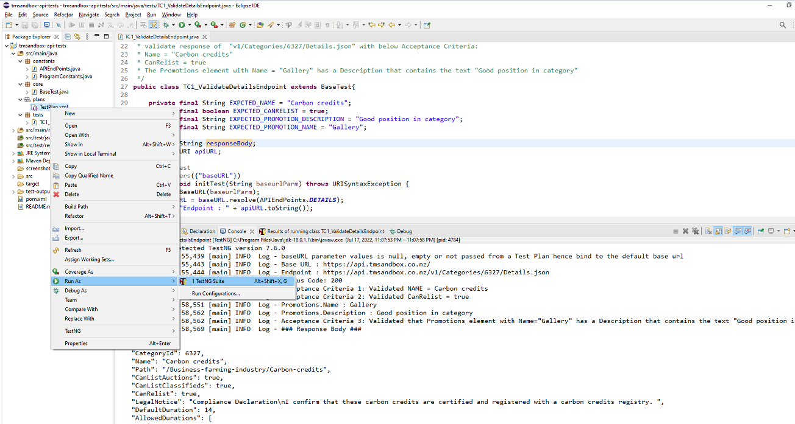

prerequisite
==================================
1. Java
2. Maven
3. Eclipse with TestNG plugin installed

Building & Running
==================================
### Build
 1. Download or clone the project source code from 

 2. If you are open project from an IDE (e.g. Eclipse) import project as a Maven project and do a force Maven update

### Run with Eclipse TestNG plugin

1. To Run a single Test go to src/main/java/tests package and run the test (e.g. TC1_VarifyDetailsEndpoint.java) as TestNG Test

2. To Run a TestNG xml go to src/main/java/plans package and run the xml (e.g. TestPlan.xml) as TestNG Suite

